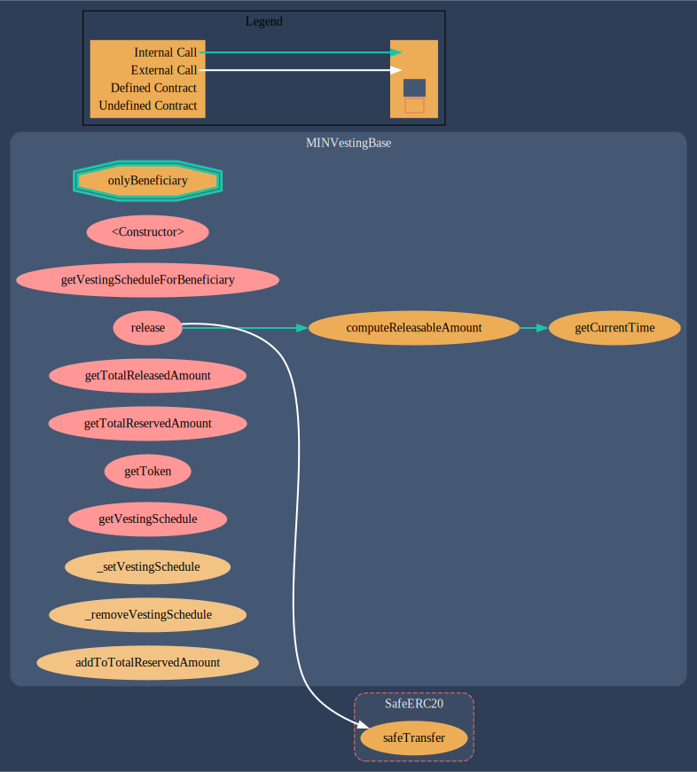
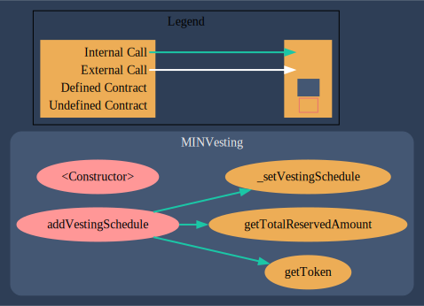
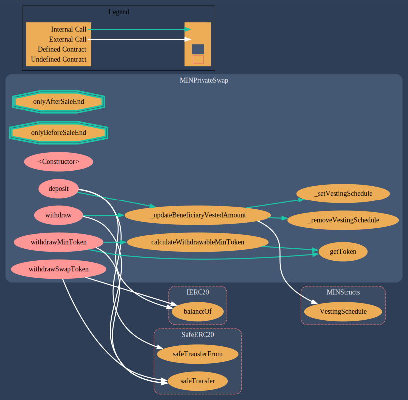
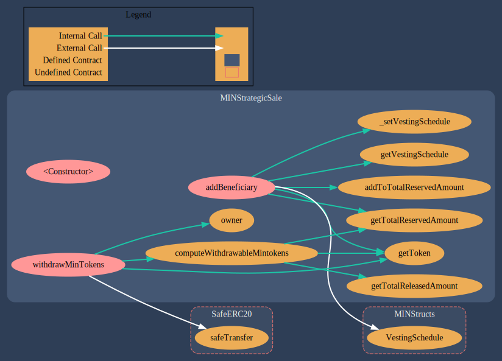

# Architectural Graphs

A detailed overview of the code structure can be found in [NatSpec docs](natspec.md), generated with OpenZeppelin's solidity-docgen

### VestingBase

### MINVesting

### MINPrivateSwap

### MINStrategicSale

